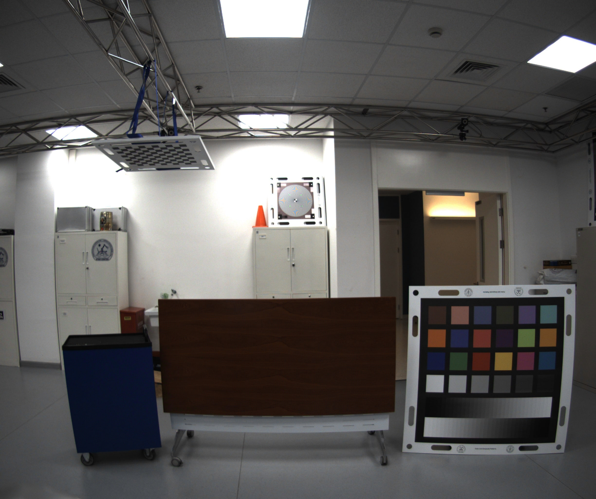

# My person website 
```https://robotics.shanghaitech.edu.cn/people/hongyu```

# fuse_lidar_point_multi_camera
This package is used for fuse camera and velodyne sensor , add color to pointcloud
## about how to use this package

```asm

 source devel/setup.bash


 roslaunch  fuse_point_multi_camera bag_play.launch


 roslaunch fuse_point_multi_camera result.launch


``` 

it will public cloud point with colors ```/point_with_color```



